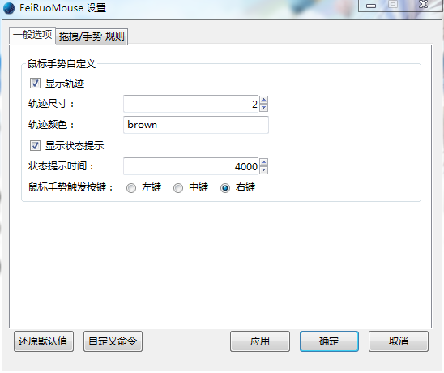
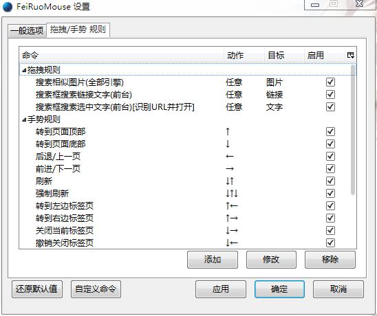
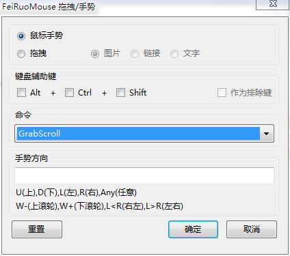

FeiRuoMouse
============
 - 支持e10s window。
 - 鼠标手势与拖拽管理。
 - 完全自定义鼠标操作（作者鼠标只有3键）。
 - 完全自定义事件执行命令。
 - 选项即时生效。
 - 配置文件位置：【chrome\lib\\_FeiRuoMouse.js】
 - 配置文件请勿删除，里面QRCode内为二维码生成需要的数据库
 
 
 
 
 
 
 
选项说明书：
--------------

- 请先看图片。
- 还原默认值：还原默认值。
- 自定义命令：打开配置文件，对自定义事件命令进行编辑（增加，删除）。
 
事件编辑，添加窗口：
--------------

- 键盘辅助键：三个键盘辅助键，可以任意组合。
- 作为排除键：在达到命令生效的条件时，同时按下所选定辅助键（组合），这个命令将不生效（即排除）
- 鼠标手势和鼠标拖拽切换之后，提示，事件和条件的内容也会改变，请仔细。

配置文件，自定义命令：
--------------

- 1、请以obj形式添加；
- 2、label：说明文字，读取标识，必须！
- 3、ActionType：动作类型，Gestures表示在鼠标手势，Drag表示鼠标拖拽；
- 4、Type：当ActionType有Drag(拖拽命令)时生效，拖拽的目标；
- 5、command：自定义行为 请以 function(event){} 函数形式
- 示例：

		{
		label: "转到页面顶部",	//命令的说明文字
		ActionType: "Gestures",//表示鼠标手势命令
		Type: "",//当ActionType有Drag(拖拽命令)时生效，拖拽的目标
		command: function(event) {//此处为自定义命令，event为通过鼠标和辅助键等判断之后传回的，监听事件event
				var doc = event.target.ownerDocument;
				var win = doc.defaultView;
				goDoCommand('cmd_scrollTop');
			}
		},{
		label: "当前标签打开图片",	//命令的说明文字
		ActionType: "Drag",//鼠标拖拽命令
		Type: "Image",//拖拽图片时的命令
		command: function(event) {//此处为自定义命令，event为通过鼠标和辅助键等判断之后传回的，监听事件event
				loadURI(event.dataTransfer.getData("application/x-moz-file-promise-url"));
			}
		}