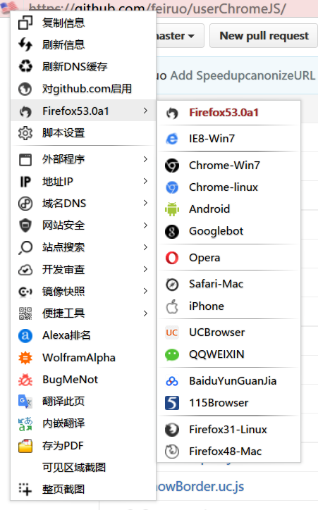

FeiRuoNet.uc.js
============
 - 网络交互信息定义，查看、自定义与网站之间的交互信息。。
 - 显示网站IP地址和所在国家国旗，支持IPV6，标示https安全等级，帮助识别网站真实性。
 - 支持本地数据库：QQWry.dat(中文)、Flagfox[ip4.cdb、ip6.cdb]（国家代码）（感谢Flagfox）。
 - 修改浏览器标识(UA)、Cookies、Referer，伪装IP，等所有Http头信息，可破解反盗链,破解限制等。
 - Http头信修改息可完全自定义字段和值，支持自定义规则(正则test)。
 - 菜单模式，集成anoBtn(https://github.com/feiruo/userChromeJS/tree/master/anoBtn)除自定图标外所有功能。
 - 集成showFlagS(https://github.com/feiruo/userChromeJS/tree/master/showFlagS)所有功能并增强。
 - 左键点击图复制IP，中键刷新，右键弹出菜单。
 - 更多功能需要【_FeiRuoNet.js】、【_FeiRuoNetMenu.js】、【FeiRuoNetLib.js】、【QQWry.dat】、【ip4.cdb】、【ip6.cdb】配置文件。
 - 配置文件位置位于：chrome\lib\ 文件夹下

	
 #注意事项
 1. 脚本正则方式均为test()，test()继承正则表达式的lastIndex属性，表达式在匹配全局标志g的时候须注意！
 2. UA修改暂时无法在E10S实现JSFIX！
 3. 配置文件内的规则方式均为正则匹配！
 4. 对于菜单配置，本脚本参数增加:  %IP%：当域名IP地址   %BASEDOMAIN%：当前域名的主域名；
 5. 留空表示不进行该行为。
 6. 规则如果是str的会使用 new RegExp(str,"i")。

#示例部分
##Http头信息修改规则
此处注意，不会覆盖原始请求，这里的只是添加，当原始请求已有是，使用规则内的替换

		var HeadRules = [ //Http Head Rules
			"/^https?://([a-zA-Z]+)\\.?kankan.com.*$/": {
				heads: val,
				heads: val,
			}
		];
		
##自定义查询API,只要是你想要显示的都可以

 		{
 			//是否启用
			Enable: false,
			//是否针对当前网站的不同端口也发送请求
			DifPort: false, 
			//脚本当次运行期间请求次数，0为每次请求。
			Times: 0, 
			//延迟，毫秒 默认1000
			timeout: '1000', 
			//请求的类型，默认 GET；例如：POST、GET、PUT及PROPFIND。大小写不敏感。
			method: 'GET', 
			//查询接口API，此处可用变量参数 %HOST%、%IP%、%URL%等（仅用于GET）具体请参照；https://github.com/ywzhaiqi/userChromeJS/tree/master/addmenuPlus
			Api: "http://whois.pconline.com.cn/", 
			//请求返回类型
			responseType: null, 	
			//用户名		
			bstrUser: null, 
			//密码
			bstrPassword: null, 
			//发送的内容，字符串，仅method为POST时有效
			SendString: null,
			//onreadystatechange
			onreadystatechange: null, 
			//overrideMimeType
			overrideMimeType: null, 
			//回应头,数组,
			getResponseHeader: ['Server', 'Content-Type'], 
			// 请求头，object
			setRequestHeader: { 
				apikey: '1234564556465',
				apikey1: '123456654789',
			},
			//截取函数,传入内容 docum 是XMLHttpRequest()的回应值。
			Func: function(docum) {
				var str
				//Your codes
				return str || null;
			}
		}

