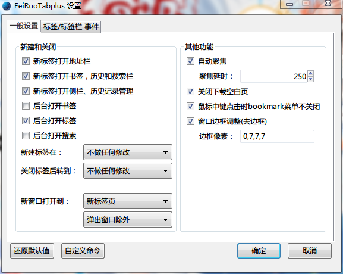
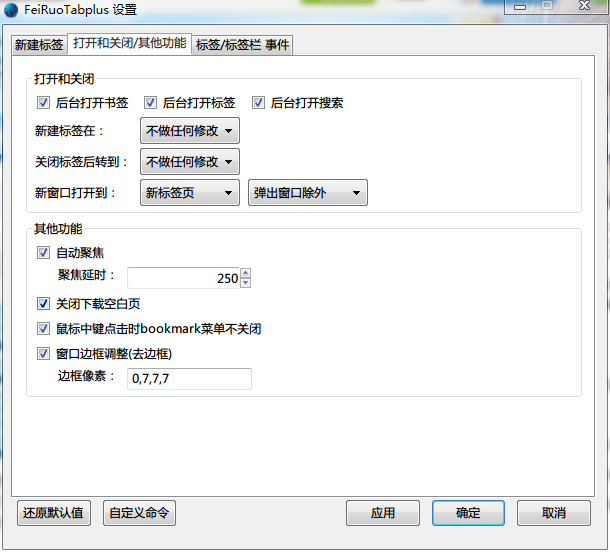
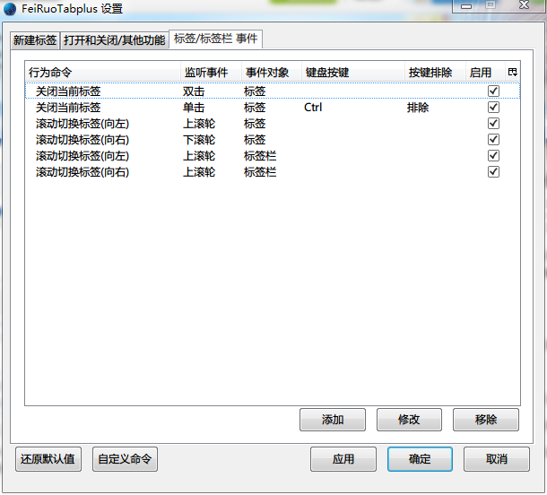

FeiRuoTabplus
============
 - 支持e10s window。
 - 标签事件管理。
 - 完全自定义鼠标操作（作者鼠标只有3键）。
 - 完全自定义事件执行命令。
 - 选项即时生效。
 - 配置文件位置：【chrome\lib\_FeiRuoTabplus.js】
 
 
 
 
选项说明书：
--------------

 - 自动聚焦：鼠标移动到标签上自动切换到该标签。
 - 聚焦延时：鼠标移动到标签上，多少毫秒之后自动切换到该标签。
 - 鼠标中键点击时bookmark菜单不关闭：bookmark菜单上鼠标中键点击时不关闭bookmark菜单。
 - 窗口边框调整：调整浏览器窗口各个边框的厚度。
 - 边框像素：你想要的边框厚度，依次为 上，左，下，右，数值越大边框越窄，实时生效。
 - 还原默认值：还原默认值。
 - 自定义命令：打开配置文件，对自定义事件命令进行编辑（增加，删除）。
事件编辑，添加窗口：
--------------

- 键盘辅助键：三个键盘辅助键，可以任意组合。
- 作为排除键：在达到命令生效的条件时，同时按下所选定辅助键（组合），这个命令将不生效（即排除）

		如：选择【Ctrl】+【作为排除键】+鼠标点击【右键】+标签事件【关闭当前标签】；
			那么当在标签上点击右键，即关闭当前标签；
			当在标签上点击右键；【同时按住】Ctrl键，则会弹出右键菜单，而不会关闭当前标签；
- 鼠标滚轮和鼠标点击切换之后，事件的内容也会改变，请仔细。
配置文件，自定义命令：
--------------

- 1、请以obj形式添加；
- 2、label：说明文字；
- 3、Tag：作用域，Tab表示在只在标签上执行该行为，TabBar表示在只在标签栏上执行该行为；
- 4、Mouse：鼠标行为，Click表示在只在鼠标点击事件执行该行为，Scroll表示在只在鼠标滚动事件执行该行为；
- ※、gBrowser：监听附着节点，请慎重 【gBrowser.**mTabContainer**】；
- 5、Command：自定义行为 请以 function(e){} 函数形式
- 示例：

		{
		label: "站内搜索",	//命令的说明文字
		Tag: "Tab TabBar",//表示标签和标签栏上都作用，在事件添加菜单中【标签事件】和【标签栏事件】都会显示该命令
		Mouse: "Click Scroll",//表示点击和滚动都作用，在事件添加菜单中【鼠标点击】和【鼠标滚轮】都会显示该命令
		gBrowser: "mTabContainer",//监听附着点，如果不清楚请勿随意更改
		Command: function(e) {//此处为自定义命令，e为通过鼠标和辅助键等判断之后传回的，监听事件event
				var s = prompt('站内搜索——请输入待搜索字符串', '');
				if (s.length > 0)
					gBrowser.addTab('http://www.google.com/search?q=site:' + encodeURIComponent(content.location.host) + ' ' + encodeURIComponent(s));
			}
		}