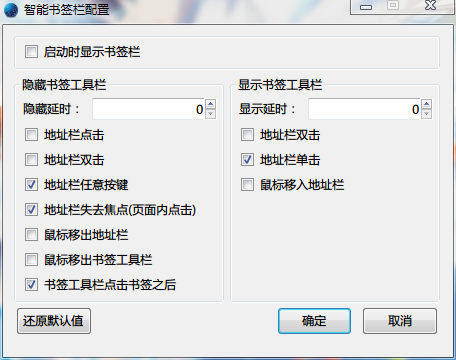
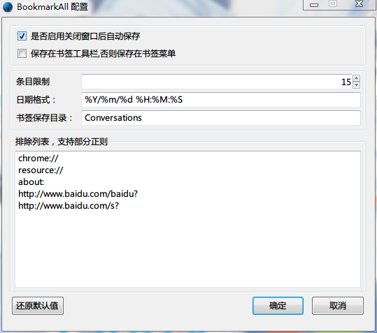

userChromeJS
============
####一些修改、原创的自用脚本,可能包含个人使用习惯。
Need this: 
https://github.com/alice0775/userChrome.js/blob/master/userChrome.js  
Or this: 
https://github.com/ywzhaiqi/userChromeJS/tree/master/userChromeJS_Mix.xpi

#####QrCreator.uc.js
1. 修改于https://raw.github.com/lastdream2013/userChrome/master/qrCreator.uc.js
2. 支持E10S
3. 支持ywzhaiqi的userChromeJS_Mix实时启用禁用
3. 本地解析二维码，支持背景图像和canvas

#####AwesomeBookmarkbar.uc.js

#####bookmarkallmod.uc.js
- 退出浏览器的时候保存所有未关闭的页面为书签；
- 可以自定义保存位置(书签工具栏/书签菜单)，保存目录等；
- 但设置了保存次数之后，达到数量会自动删除较早的条目。

#####bookmarkBtn.uc.js
- 可移动书签菜单按钮；
- 方便FF23以下版本和UX版本。

#####starClickMod.uc.js
- 多功能收藏按钮，支持UX版Fireofx；
- 单击收藏按钮自动弹出书签编辑面板；
- 自动获取上次使用的文件夹并选中；
- 书签编辑面板自动展开文件夹选择面板；
- 书签编辑面板增加关键字、标签、侧边栏打开等；
- 右键单击收藏按钮从收藏中删除当前页面。

#####starClickMod40Up.uc.js
- 仅支持40Up。
- 全面修复。
- 设置放入about:config中，即时生效。
- userChromeJS.starClickMod.isAutoPopup;  是否自动弹出面板
- userChromeJS.starClickMod.isLastFolder; 是否自动定位到上次使用的文件夹

#####StarUrlicon.uc.js
- 新版UI移动整个书签按钮到地址栏；
- 添加右键 显示/隐藏 书签侧栏，中键删除当前页面书签；
- 推荐和bookmarkBtn.uc.js同时使用，并使用CSS：

		#bookmarks-menu-button > dropmarker {display: none !important;}
		

#####FeiRuoBackup.uc.js
- 备份、整合和还原配置文件。
- 需要在脚本内自行参照示例设置。
- 暂只支持文本形式文件的备份、整合和还原。
- FeiRuoBackup.Toggle() 可以实时开启或关闭。
- 菜单栏 → 工具 → 备份还原文件 可查看启用状态，实时开启或关闭
