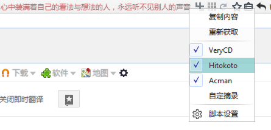
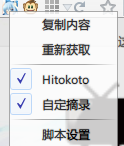
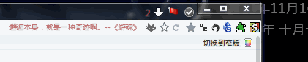
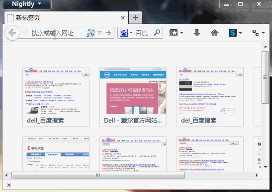

Saying
============

 - 地址栏显示自定义语句，根据网址切换。
 - 目前可自动获取并更新。
 - 每次关闭浏览器后数据库添加获取过的内容，并去重复。
 - 左键图标复制内容，中键重新获取，右键弹出菜单。
 - 其他详细设置请参照脚本内的设置。
 - API和规则在_Saying.js自己添加，此文件脚本只读取，格式请参照例子。
 - 自定义内容可在_Saying.js自己添加，此文件脚本只读取，格式请参照例子。
 - 设置项左键打开设置窗口，中键重载配置，右键：编辑配置文件。
 - 数据库位置：

		Chrome\lib\_Saying.js
		Chrome\lib\Saying_*.json

