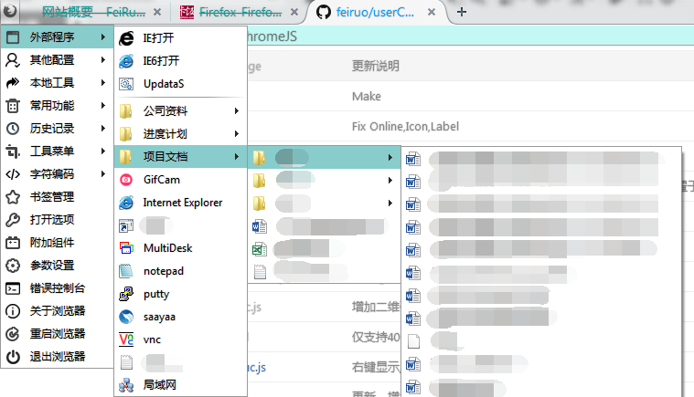

anoBtn.uc.js
============
 - 感谢 ywzhaiqi
 - AnotherButton按钮菜单。
 - tools-menu 等内置菜单的重载、按钮重载，请参考配置文件。
 - 使用外部配置文件，请参考配置文件。
 - 工具菜单中增加一个重载菜单，左键重载，右键编辑配置文件。
 - 支持多级菜单（如无特殊需求，不推荐，影响体验）。
 - 支持文件夹枚举文件。
 - 配置与addmenu一样，但仅支持本脚本菜单位置，具体请参照；https://github.com/ywzhaiqi/userChromeJS/tree/master/addmenuPlus
 - 配置文件位置：

		Chrome\lib\_anoBtn.js

 - 目录枚举添加请注意：
 1. 斜杠"/"或"\"开头为相对配置文件夹，注意：Linux路径区分大小写！！！！
 2. 根据文件名全名字符(包括扩展名)排除或筛选;
 3. 关系为：先排除再枚举。
 4. 注意：配对模式为 test循环模式正则！！！注意正则全局"g"的使用！！test()继承正则表达式的lastIndex属性，表达式在匹配全局标志g的时候须注意。
 5. 留空表示不进行该行为。
 6. 在文件夹上左键点击为打开文件夹
 
 - 示例：

 		{
 			label: "菜单显示名称",
 			image: "图标",
 			//枚举文件夹内的所有文件。注意：Linux路径区分大小写！！！！
 			MapFolder: '/chrome/tools',
 			//排除的文件，需要注意:此处不使用"g"全局模式，可以匹配所有文件,
 			Exclude: /\.(dat|reg|sample|config|db|log|dll|json|zip|rar|ini)$|7za\.exe|wget\.exe/i,
 			//枚举的文件
 			Filter: /\.(exe|lnk|bat|xls|xlsx|txt|doc|docx|jpg|wps)$/i,
 			//是否枚举子目录内的文件，值代表子目录深度，多少级的子目录，0为根目录（即不枚举子目录）
 			Directories: 2,
 			//排除目录,仅当Dirs>1时生效。
 			ExcludeDirs: /tmp|temp|ConFile|msdll/i，
 			//枚举目录,仅当Dirs>1时生效。留空表示不筛选
 			FilterDirs: "",
 		},

