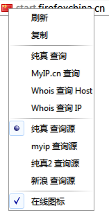
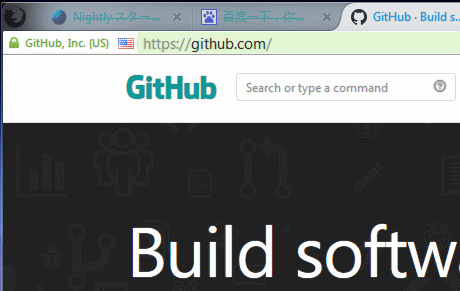

showFlagS
============
 - author：ywzhaiqi、feiruo。
 - 参考 Show Location 扩展、Flagfox 扩展、http://files.cnblogs.com/ziyunfei/showFlag.uc.js 。
 - 显示网站IP地址和国旗，帮助识别网站真实性。
 - 打开本地文件的时候会显示文件夹图标。
 - 位置为identity-box时,https,about和chrome页面，隐藏脚本图标，还原identity-box显示。
 - 延迟，时间内未取得所选择查询源数据，就使用新浪查询源，可以在脚本里面设置。
 - 脚本里面可以修改图标位置等。
  
 - 可选择查询地址，目前内置4个，可以在脚本里面添加。
 - 国旗图标左键复制内容，中键刷新，右键弹出菜单。
  
  
  
 - 本地数据库位置：

	Chrome\lib\countryflags.js

 注意：
--------------
- myip地址是从myip网站获得图标，不使用本地图标，所以略有延迟；而且myip不稳定。
- 就算选择在线图标，也是优先使用本地数据库。
- 文如果使用faviconContextMenu，请在图标外面右键，图标上面右键是脚本的菜单。
- 鼠标中键点击图标会同时载入配置文件和中文规则数据库文件。
- 如果有特殊需要显示 网站标识(page-proxy-favicon)的，请添加以下样式：

	#page-proxy-favicon{visibility: visible !important;}

   